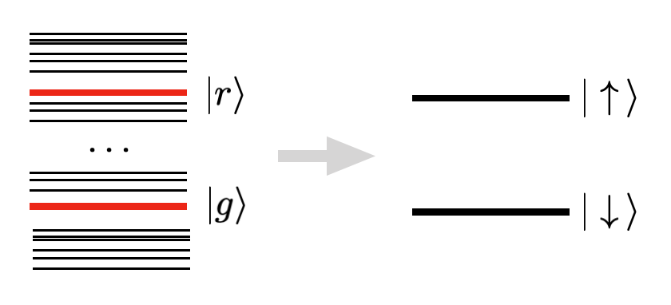
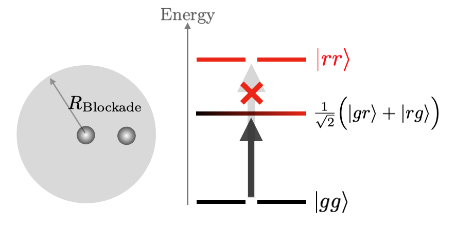
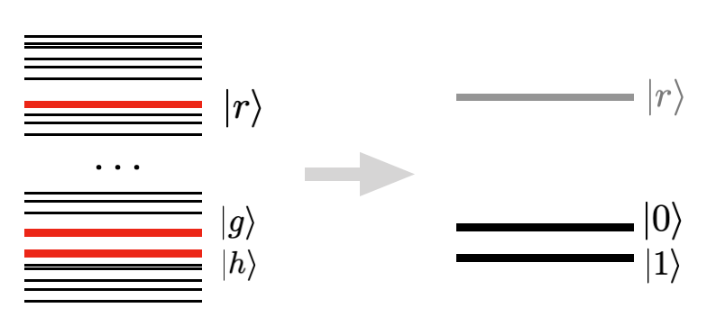

****************************************
Quantum Computing with Neutral Atoms
****************************************

Programmable arrays of Rydberg atoms
####################################

With the rise in our capacity to control and explore synthetic quantum
systems, the opportunity to use them to address questions of scientific and
industrial interest has attracted the efforts of a large community of
researchers. Today, the control of single atoms as well as the tuning of their
interactions has been achieved to a high degree in several laboratories.
One of the leading architectures for constructing these *programmable* devices
consists in arranging ensembles of individual (trapped) atoms separated by a
few micrometers. In order to generate interactions between them, they are
excited by a resonant laser field to a **Rydberg level**, which has a large
principal quantum number. At the Rydberg state, the atoms present long
lifetimes and large interaction strengths and are briefly called
**Rydberg atoms**.

**Pulser** is an open-source software package written in Python whose main
objective is to provide easy-to-use libraries for designing and simulating
pulse sequences that act in programmable Rydberg atom arrays.

Implementation and Theoretical Details
######################################

Hardware Characteristics
**************************
In a nutshell, neutral atom devices feature two main components:

* The **Register**, a group of trapped atoms in a defined (but reconfigurable)
  configuration. Each atom holds a specific quantum state encoded in specific
  electronic levels. Usually these are two-level systems and we refer to them
  as *qubits*.
* The **Channels**, responsible for manipulating the state of the atoms by
  addressing specific electronic transitions. These consist most often, but not
  exclusively, of lasers.

Each **Device** will impose specific restrictions on these components -- they define things
like how many atoms a Register can hold and in what configurations they can be
arranged in; what channels are available and what values they can reach, among others.
For this reason, a **Sequence** is closely dependent on the **Device** it
is meant to run on and should be created with it in mind from the start.

This **Sequence** is the central object in Pulser and it consists essentially
of a series of **Pulses** (and other instructions) that are sequentially
allocated to channels.

Each **Pulse** describes, over a finite duration, the modulation of a
channel's output *amplitude*, *detuning* and *phase*. While the phase is constant
throughout a pulse, the amplitude and detuning are described by **Waveforms**,
which define these quantities values throughout the pulse.

.. figure:: https://pasqal.io/wp-content/uploads/2021/02/pulser_animation.gif
    :align: center
    :alt: pulser_animation
    :figclass: align-center

    A pulse sequence and its execution on a given device.

In the animation above, we find an example of a Sequence composed of three
channels, each containing different pulses played at specific times. Upon
execution, the channels emit this coordinated stream of pulses, which manipulate
the state of the atoms in the register.

Now, what is left to know is *how* these channels manipulate the state the atoms
so that we can program them to do meaningful things. To do this, we have to dive
into the physics and try to understand the underlying **Hamiltonian** of our
systems.

Quantum Hamiltonian
*******************

Let us call the initial state of the atoms their **ground state** and denote it
by :math:`|g\rangle`. The incident laser field will then try to excite them to
a Rydberg level, which we shall write as :math:`|r\rangle`. These two states
can be thought of as the two levels of a quantum spin.

The laser can be characterized by its **Rabi frequency** :math:`\Omega(t)`
(which is in general a function of time). It can also be **detuned** from the
resonance frequency by an amount :math:`\delta(t)``. Both Rabi frequency and
detuning are the basic parameters that we will be able to tune and they
define a **pulse**. In terms of the Hamiltonian of our system, a pulse on
an atom :math:`i` results in the following term:

.. math:: \frac{\hbar\Omega(t)}{2} \sigma_i^x + \hbar \delta(t) \sigma_i^z,

where :math:`\sigma^\alpha` for :math:`\alpha = x,y,z` are the Pauli matrices.

The interaction between two atoms at distance :math:`R` and at the same Rydberg
level is described by the **Van der Waals force**, which scales as
:math:`R^{-6}`. This interaction can be exploited to create fast and
robust quantum gates, using the so-called **Rydberg Blockade Effect** between
them. This effect consists on the shift in energy between the doubly excited
Rydberg state of nearby atoms and their ground state, making it non-resonant
with an applied laser field coupling the ground and Rydberg levels.

Because of the Rydberg blockade, an atom cannot be excited to the Rydberg level
if a nearby atom is already in such state. To represent this interaction as
operators in a Hamiltonian, we write them as a penalty for the state in which
both atoms are excited:

.. math:: U_{ij} n_i n_j,

where :math:`n = (1+\sigma^z)/2` is the projector on the Rydberg state,
:math:`U_{ij} \propto R_{ij}^{-6}` and :math:`R_{ij}` is the distance
between the atoms :math:`i` and :math:`j`. The proportionality constant is set
by the chosen Rydberg level. If the atoms are excited simultaneously, only the
entangled state :math:`(|gr\rangle + |rg\rangle)/\sqrt 2` is obtained.

The entire array of interacting atoms can be represented as an Ising-like
Hamiltonian:

.. math::
   H = \frac{\hbar}{2} \sum_i  \Omega_i(t) \sigma_i^x - \hbar \sum_i
       \delta(t) \sigma_i^z + \sum_{i<j} U_{ij} n_i n_j

Digital and Analog Approaches
#############################

Analog Approach
***************

In the analog simulation approach, the laser field acts on the entire array
of atoms. This creates a **global** Hamiltonian of the form

.. math::
   H = \frac{\hbar\Omega(t)}{2} \sum_i  \sigma_i^x - \hbar \delta(t) \sum_i
        \sigma_i^z + \sum_{i<j} U_{ij} n_i n_j

Digital Approach
****************

Pulser provides an interface for constructing pulse-based quantum
computation programs at the digital level. In this approach, we begin by
selecting another level close to :math:`|g\rangle` which we call the
**hyperfine** state and is denoted :math:`|h\rangle`. An atom can go from one
state to the other via Raman transitions, generated by a **local** laser pulse
with parameters :math:`\Omega, \delta`. The Rydberg level is now used
ancillarily in order to generate a conditional logic on the atoms by attempting
an excitation which will be blocked (or not) depending on the distance and
current levels of the involved atoms.

