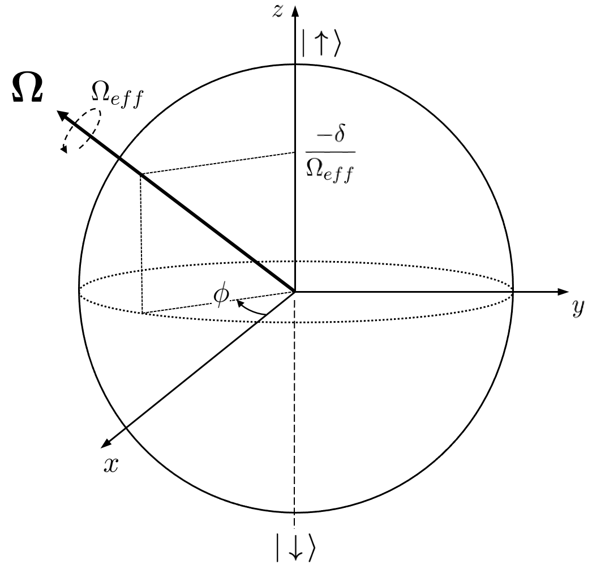

****************************************
Quantum Computing with Neutral Atoms
****************************************

Programmable arrays of Rydberg atoms
####################################

With the rise in our capacity to control and explore synthetic quantum
systems, the opportunity to use them to address questions of scientific and
industrial interest has attracted the efforts of a large community of
researchers. Today, the control of single atoms as well as the tuning of their
interactions has been achieved to a high degree in several laboratories.
One of the leading architectures for constructing these *programmable* devices
consists in arranging ensembles of individual (trapped) atoms separated by a
few micrometers. In order to generate interactions between them, they are
excited by a resonant laser field to a **Rydberg level**, which has a large
principal quantum number. At the Rydberg state, the atoms present long
lifetimes and large interaction strengths and are briefly called
**Rydberg atoms**.

This page gives brief insight into the concepts behind **Pulser** and
the use of neutral-atom devices for quantum computation and simulation. For
more details, see `Quantum 4, 327 (2020) <https://quantum-journal.org/papers/q-2020-09-21-327/>`_
for a comprehensive overview of quantum computing with neutral atoms,
`Nature Physics volume 16, pages132–142(2020) <https://www.nature.com/articles/s41567-019-0733-z>`_
for a review that's more focused on their use as a quantum simulation, or even
`M Saffman 2016 J. Phys. B: At. Mol. Opt. Phys. 49 202001 <https://iopscience.iop.org/article/10.1088/0953-4075/49/20/202001>`_.

Implementation and Theoretical Details
######################################

Hardware Characteristics
**************************
In a nutshell, neutral atom devices feature two main components:

* The **Register**, a group of trapped atoms in a defined (but reconfigurable)
  configuration. Each atom holds a specific quantum state encoded in specific
  electronic levels. Usually these are two-level systems and we refer to them
  as *qubits*.
* The **Channels**, responsible for manipulating the state of the atoms by
  addressing specific electronic transitions. These consist most often, but not
  exclusively, of lasers.

Each **Device** will impose specific restrictions on these components -- they define things
like how many atoms a Register can hold and in what configurations they can be
arranged in; what channels are available and what values they can reach, among others.
For this reason, a **Sequence** is closely dependent on the **Device** it
is meant to run on and should be created with it in mind from the start.

This **Sequence** is the central object in Pulser and it consists essentially
of a series of **Pulses** (and other instructions) that are sequentially
allocated to channels.

Each **Pulse** describes, over a finite duration, the modulation of a
channel's output *amplitude*, *detuning* and *phase*. While the phase is constant
throughout a pulse, the amplitude and detuning are described by **Waveforms**,
which define these quantities values throughout the pulse.

.. figure:: https://pasqal.io/wp-content/uploads/2021/02/pulser_animation.gif
    :align: center
    :alt: pulser_animation
    :figclass: align-center

    A pulse sequence and its execution on a given device.

In the animation above, we find an example of a Sequence composed of three
channels, each containing different pulses played at specific times. Upon
execution, the channels emit this coordinated stream of pulses, which manipulate
the state of the atoms in the register.

Now, what is left to know is *how* these channels manipulate the state the atoms
so that we can program them to do meaningful things. To do this, we have to dive
into the physics and try to understand the underlying **Hamiltonian** of our
systems.

Driving two-level transitions
******************************

Each channel is tuned such that each of its pulses coherently drives a
specific electronic transition between two energy levels of an atom.
For instance, when addressing the ``ground-rydberg`` transition, we have that
our targeted levels are the ground state, :math:`|g\rangle`, and the Rydberg
state, :math:`|r\rangle`. These two states can be thought of as the two levels
of a quantum spin.

.. image:: files/ground_rydberg.png
  :align: center
  :width: 400
  :alt: The ground and Rydberg levels become the states of a spin system.

In this system, a pulse acting on an atom :math:`i`, with **Rabi frequency**
:math:`\Omega(t)`, **detuning** :math:`\delta(t)` and a fixed phase :math:`\phi`,
will have the Hamiltonian terms:

.. math:: \frac{\hbar\Omega(t)}{2} (\cos(\phi)\sigma_i^x - \sin(\phi)\sigma_i^y) - \frac{\hbar}{2} \delta(t) \sigma_i^z,

where :math:`\sigma^\alpha` for :math:`\alpha = x,y,z` are the Pauli matrices.
Alternatively, one can rewrite this term as:

.. math:: \frac{\hbar}{2} \mathbf{\Omega}(t)\cdot \boldsymbol{\sigma}_i,

where :math:`\mathbf{\Omega}(t) = (\Omega(t) \cos(\phi),-\Omega(t) \sin(\phi),-\delta(t))^T`
and :math:`\boldsymbol{\sigma}` is the vector of Pauli matrices. In the Bloch sphere representation,
for each instant :math:`t`, this Hamiltonian describes a rotation around the axis
:math:`\mathbf{\Omega}` with angular velocity :math:`\Omega_{eff} = |\mathbf{\Omega}| = \sqrt{\Omega^2 + \delta^2}`,
as illustrated in the figure below.

        Bloch sphere.

Rydberg states
******************************

In neutral atom devices, atoms are driven to Rydberg states as a way to make
them interact over large distances. The interaction between two atoms at distance
:math:`R` and at the same Rydberg level is described by the **Van der Waals force**,
which scales as :math:`R^{-6}`. This interaction can be exploited to create fast and
robust quantum gates, using the so-called **Rydberg Blockade Effect** between
them. This effect consists on the shift in energy between the doubly excited
Rydberg state of nearby atoms and their ground state, making it non-resonant
with an applied laser field coupling the ground and Rydberg levels.

.. image:: files/ryd_block.png
  :align: center
  :width: 400
  :alt: There is no simultaneous transition to the doubly excited state inside the blockade radius.

Because of the Rydberg blockade, an atom cannot be excited to the Rydberg level
if a nearby atom is already in such state. To represent this interaction as
operators in a Hamiltonian, we write them as a penalty for the state in which
both atoms are excited:

.. math:: U_{ij} n_i n_j,

where :math:`n = (1+\sigma^z)/2` is the projector on the Rydberg state,
:math:`U_{ij} \propto R_{ij}^{-6}` and :math:`R_{ij}` is the distance
between the atoms :math:`i` and :math:`j`. The proportionality constant is set
by the chosen Rydberg level. If the atoms are excited simultaneously, only the
entangled state :math:`(|gr\rangle + |rg\rangle)/\sqrt 2` is obtained.

An entire array of interacting atoms, acted on by the same pulse, can be
represented as an Ising-like Hamiltonian:

.. math::
   H = \frac{\hbar}{2} \sum_i  \Omega_i(t) \sigma_i^x - \frac{\hbar}{2} \sum_i
       \delta(t) \sigma_i^z + \sum_{i<j} U_{ij} n_i n_j

Digital and Analog Approaches
#############################

Analog Approach
***************

In the analog simulation approach, the laser field acts on the entire array
of atoms. This creates a **global** Hamiltonian of the form

.. math::
   H = \frac{\hbar\Omega(t)}{2} \sum_i  \sigma_i^x - \frac{\hbar\delta(t)}{2} \sum_i
        \sigma_i^z + \sum_{i<j} U_{ij} n_i n_j

Through the continuous manipulation of :math:`\Omega(t)` and :math:`\delta(t)`,
one has a very high degree of control over the system's dynamics and properties.
In this way, the analog approach enables the quantum simulation of many-body
quantum systems, but also provides novel ways of solving combinatorial problems
that can be mapped onto the hamiltonian above.

Digital Approach
****************

In opposition to the analog approach stands the digital approach, in which
a system's state evolves through a series of discrete manipulations of its qubits'
states, also known as quantum gates. This is the underlying approach in quantum
circuits and it can be replicated on neutral-atom devices at the pulse-level. To
this extent, the qubit states are encoded in two hyperfine ground states of the
system, named `ground`, :math:`|g\rangle`, and `hyperfine`, :math:`|h\rangle`. In
Pulser, these states form the ``digital`` basis, which is addressed by ``Raman``
channels. In the digital approach, these channels are usually `Local`, meaning they
target individual qubits instead of the entire system.

Since the Rydberg blockade effect is not present when atoms are in :math:`|g\rangle` or :math:`|h\rangle`,
the dynamics of each qubit's state are just determined by the driving pulses,
already illustrated above as rotations on the Bloch sphere. By tuning the parameters of a pulse,
we can achieve any arbitrary single-qubit unitary, as is shown in :doc:`tutorials/phase_shifts_vz_gates`.

.. image:: files/digital.png
  :align: center
  :width: 400
  :alt: The three levels involved in the digital-level approach.

However, without the interaction introduced by the Rydberg blockade effect, it is not
possible to do multi-qubit gates. Therefore, the Rydberg level is used
ancillarily in order to generate a conditional logic on the atoms by attempting
an excitation which will be blocked (or not) depending on the distance and
current levels of the involved atoms. This is the key behind the `CZ gate`, whose
implementation is detailed in :doc:`tutorials/cz_gate`.
